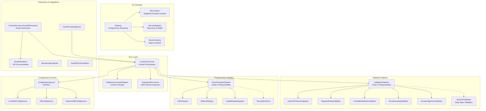
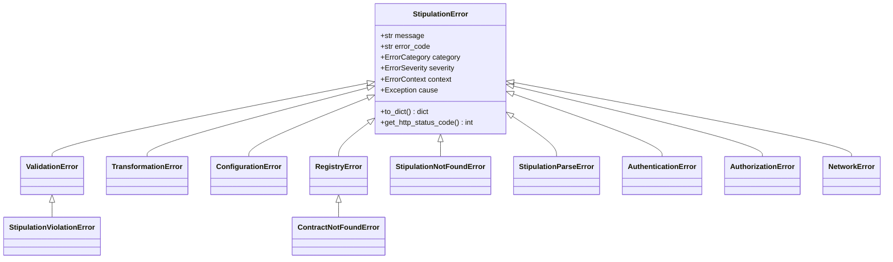

# Architecture

## System Overview

Contract Governor is a policy-driven framework for governing OpenAPI contract validation, transformation, and exposure in distributed systems. It enforces a strict separation between raw backend contracts and the contracts exposed to clients, ensuring that only validated, transformed, and audit-stamped specifications reach consumers.

### Design Philosophy

The system is built on four core principles:

1. **SOLID Principles** — Each class has a single responsibility, components are open for extension but closed for modification, and high-level modules depend on abstractions rather than concrete implementations.
2. **Dependency Injection** — A lightweight DI container manages service lifecycles and enables loose coupling between components.
3. **Clean Separation** — Raw contracts from backend services are never exposed directly. A strict pipeline of validation → transformation → exposure ensures governance compliance.
4. **Policy as Configuration** — Governance rules are expressed as declarative stipulation configurations (YAML/JSON), not hard-coded logic.

---

## Component Diagram



---

## Data Flow

The governance pipeline processes contracts through four sequential stages:

```mermaid
flowchart LR
    A[Ingestion] --> B[Validation] --> C[Transformation] --> D[Exposure]

    subgraph "Stage 1: Ingestion"
        A1[Backend Service<br/>provides OpenAPI spec]
        A2[ingest_backend_contract]
        A3[RawContractRecord<br/>stored in Registry]
    end

    subgraph "Stage 2: Validation"
        B1[Load StipulationConfig]
        B2[ValidationPipeline<br/>runs validator chain]
        B3[ValidationResult<br/>pass/fail with errors]
    end

    subgraph "Stage 3: Transformation"
        C1[TransformationPipeline<br/>runs transformer chain]
        C2[URL Rewriting]
        C3[Method Stripping]
        C4[Audit Metadata Injection]
    end

    subgraph "Stage 4: Exposure"
        D1[ExposedContractRecord<br/>stored in Registry]
        D2[FastAPI Router<br/>serves to clients]
        D3[Scalar Documentation]
    end

    A1 --> A2 --> A3
    A3 --> B1 --> B2 --> B3
    B3 -->|valid| C1 --> C2 --> C3 --> C4
    C4 --> D1 --> D2 --> D3
    B3 -->|invalid| E[StipulationViolationError]
```



### Stage Details

| Stage | Input | Output | Failure Mode |
|-------|-------|--------|--------------|
| **Ingestion** | Raw OpenAPI spec + metadata | `RawContractRecord` in registry | Validation errors on record fields |
| **Validation** | Raw spec + `StipulationConfig` | `ValidationResult` (pass/fail) | `StipulationViolationError` with detailed errors |
| **Transformation** | Validated spec + `TransformContext` | Transformed OpenAPI spec | `TransformationError` with stage info |
| **Exposure** | Transformed spec + audit metadata | `ExposedContractRecord` in registry | `RegistryError` on storage failure |

---

## Module Structure

| Package | Responsibility |
|---------|---------------|
| `core/` | Central orchestrator (`ContractGovernor`), data models, error hierarchy, in-memory registry, monitoring, stipulation processing, and template expansion |
| `config/` | Configuration loading, field validation, YAML/JSON parsing, application defaults, and the `ConfigurationSource` implementations (local file, S3, DynamoDB) |
| `di/` | Lightweight dependency injection container, service registry, factory patterns, decorators (`@injectable`, `@inject`, `@auto_wire`), and config-driven setup |
| `discovery/` | Service discovery utilities (reserved for future expansion) |
| `entitlements/` | Entitlement generation models and logic for access control |
| `extensions/` | Framework extensions — currently `ContractGovernorFastAPIExtension` for route generation from exposed contracts |
| `integrations/` | Framework-specific servers (FastAPI, Flask, Django stubs), error handlers, monitoring endpoints, Scalar documentation renderer, catalog providers, and framework registry |
| `interfaces/` | Abstract base classes defining contracts: `ContractRegistry`, `ConfigurationSource`, `Validator`, `Transformer`, `DocumentationRenderer`, `CatalogServer`, and concern interfaces |
| `loaders/` | Contract loading utilities — local file loader and S3 loader for fetching raw OpenAPI specs |
| `transformation/` | Transformation pipeline, built-in transformers (URL rewriter, method stripper, audit injector, security enforcer), URL template resolver, and audit hash utilities |
| `validation/` | Validation pipeline, built-in validators (OpenAPI version, required fields, forbidden methods, tenant scoping, version alignment), and optional deep OpenAPI validation via `openapi-core` |

---

## Extension Points

Contract Governor is designed for extensibility at multiple levels:

### Custom Validators

Implement the `BaseValidator` abstract class and add to the pipeline:

```python
from contract_governor.validation.validators import BaseValidator
from contract_governor.core.models import StipulationConfig, ValidationResult

class CustomSchemaValidator(BaseValidator):
    def validate(self, contract: dict, stipulation: StipulationConfig) -> ValidationResult:
        result = self._create_result(stipulation)
        # Custom validation logic
        return result

# Add to pipeline
pipeline = ValidationPipeline(stipulation)
pipeline.add_validator(CustomSchemaValidator())
```

Alternatively, implement the full `Validator` interface from `contract_governor.interfaces.validator` for richer metadata (name, supported fields, applicability checks, execution order).

### Custom Transformers

Implement the `BaseTransformer` abstract class and add to the pipeline:

```python
from contract_governor.transformation.transformers import BaseTransformer
from contract_governor.core.models import StipulationConfig, TransformContext

class CustomHeaderInjector(BaseTransformer):
    def transform(self, contract: dict, context: TransformContext,
                  stipulation: StipulationConfig) -> dict:
        # Custom transformation logic
        return contract

# Add to pipeline
pipeline = TransformationPipeline(stipulation)
pipeline.add_transformer(CustomHeaderInjector())
```

The full `Transformer` interface from `contract_governor.interfaces.transformer` adds support for applicability checks, execution ordering, and supported stipulation field declarations.

### Custom Documentation Renderers

Implement the `DocumentationRenderer` interface:

```python
from contract_governor.interfaces.documentation_renderer import DocumentationRenderer

class SwaggerUIRenderer(DocumentationRenderer):
    def render_catalog_page(self, contracts: list) -> str: ...
    def render_contract_page(self, contract_url: str, title: str) -> str: ...
    def get_renderer_config(self, contract_url: str) -> dict: ...
    def get_catalog_config(self, contracts: list) -> dict: ...
    def supports_multi_api(self) -> bool: ...
```

### Custom Configuration Sources

Implement the `ConfigurationSource` interface to load stipulations from any backend:

```python
from contract_governor.interfaces.configuration_source import ConfigurationSource

class ConsulConfigSource(ConfigurationSource):
    def load_stipulations(self) -> dict: ...
    def load_stipulation(self, category: str, api_major_version: str): ...
    def save_stipulation(self, category: str, api_major_version: str, config): ...
    def delete_stipulation(self, category: str, api_major_version: str) -> bool: ...
    def list_categories(self) -> list: ...
    def list_versions(self, category: str) -> list: ...
    def is_available(self) -> bool: ...
    def get_source_info(self) -> dict: ...
```

Built-in implementations: `LocalFileConfigSource`, `S3ConfigSource`, `DynamoDBConfigSource`.

### Custom Contract Registry

Implement the `ContractRegistry` interface for alternative storage backends:

```python
from contract_governor.interfaces.contract_registry import ContractRegistry

class RedisContractRegistry(ContractRegistry):
    def store_raw_contract(self, record): ...
    def get_raw_contract(self, category, api_major): ...
    def list_raw_contracts(self): ...
    def store_exposed_contract(self, record): ...
    def get_exposed_contract(self, category, api_major): ...
    def list_exposed_contracts(self, filters=None): ...
    def remove_raw_contract(self, category, api_major) -> bool: ...
    def remove_exposed_contract(self, category, api_major) -> bool: ...
    def clear_all_contracts(self): ...
    def get_contract_count(self) -> dict: ...
```

---

## Dependency Injection

The `di/` package provides a lightweight DI framework with three core components:

### DIContainer

Thread-safe container managing service registration and resolution with two lifecycle scopes:

| Scope | Behavior |
|-------|----------|
| `Scope.SINGLETON` | One instance per container lifetime (cached after first resolution) |
| `Scope.TRANSIENT` | New instance created on every `resolve()` call |

```python
from contract_governor.di import DIContainer, Scope

container = DIContainer()

# Register interface → implementation
container.register(ContractRegistry, InMemoryContractRegistry, Scope.SINGLETON)

# Register pre-created instance
container.register_instance(ContractRegistry, my_registry)

# Resolve (auto-injects constructor dependencies)
registry = container.resolve(ContractRegistry)
```

The container supports **automatic constructor injection** — when resolving a class, it inspects `__init__` type annotations and recursively resolves dependencies.

### ServiceRegistry

Centralized registry for service metadata, health checking, and tag-based discovery:

```python
from contract_governor.di import ServiceRegistry

registry = ServiceRegistry()
registry.register_service(
    interface=ContractRegistry,
    implementation=InMemoryContractRegistry,
    scope="singleton",
    tags=["storage", "core"],
    health_check=lambda: True
)

# Discovery
storage_services = registry.find_services_by_tag("storage")
```

### Decorators

- `@injectable(interface, scope, name, tags)` — Marks a class for auto-registration
- `@inject(container_attr)` — Resolves method parameters from the container
- `@auto_wire(container_attr)` — Class decorator that auto-resolves `__init__` dependencies

### Configuration-Driven Setup

`DISetup` bootstraps the container from YAML/JSON configuration files:

```python
from contract_governor.di import DISetup

setup = DISetup()
setup.setup_from_file("config/di_config.yaml")
container = setup.get_container()
```

---

## Error Handling

All errors inherit from `StipulationError`, which provides structured error information with context for monitoring, logging, and HTTP response generation.

### Error Hierarchy



### Error Categories and HTTP Mapping

| Error Class | Category | HTTP Status | When Raised |
|-------------|----------|-------------|-------------|
| `StipulationViolationError` | Validation | 400 | Contract fails stipulation validation |
| `ContractNotFoundError` | Registry | 404 | No raw/exposed contract exists for key |
| `StipulationNotFoundError` | Configuration | 404 | No stipulation file exists |
| `StipulationParseError` | Configuration | 422 | Stipulation file exists but failed to parse |
| `TransformationError` | Transformation | 422 | Transformation pipeline failure |
| `RegistryError` | Registry | 500 | Registry operation failure |
| `ConfigurationError` | Configuration | 500 | Invalid or missing configuration |
| `AuthenticationError` | Authentication | 401 | Authentication failure |
| `AuthorizationError` | Authorization | 403 | Insufficient permissions |
| `NetworkError` | Network | 502 | External service communication failure |

### ErrorContext

Every error carries an `ErrorContext` dataclass with structured debugging information:

```python
@dataclass
class ErrorContext:
    timestamp: datetime
    request_id: Optional[str]
    user_id: Optional[str]
    service_name: Optional[str]
    contract_category: Optional[str]
    api_major_version: Optional[str]
    stipulation_id: Optional[str]
    operation: Optional[str]
    additional_data: Dict[str, Any]
```

This enables consistent error reporting across monitoring systems, API responses, and audit logs.
